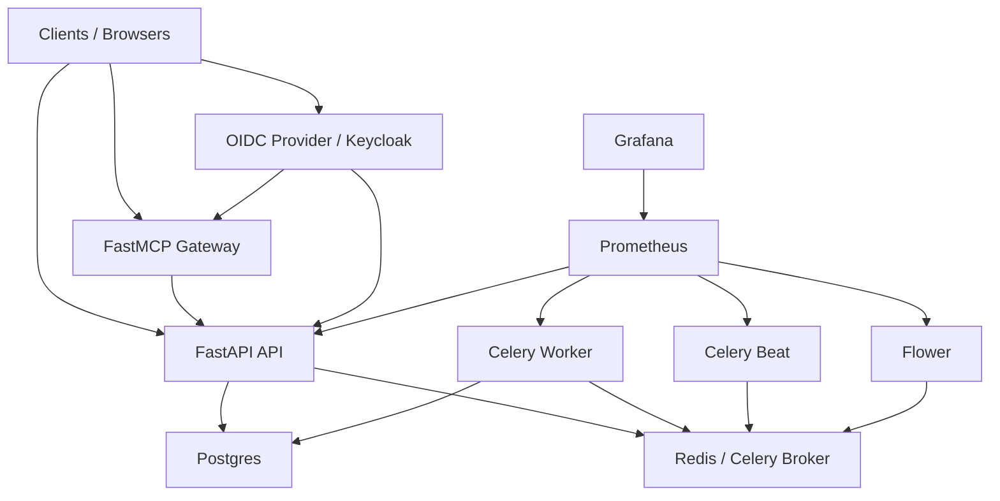

# Architecture

This document explains how the service is split into runtimes and modules, and how the main inventory and metrics flows work.

## Runtime topology

## Runtime responsibilities

| Runtime | Responsibility | Main entrypoint |
| --- | --- | --- |
| API | CRUD surface, manual triggers, Swagger, auth, and task enqueue | `app/api/main.py` |
| MCP | Read-only proxy over the product API | `app/mcp/main.py` |
| Worker | Executes inventory, metrics, and dispatcher tasks | `app/worker/celery.py` |
| Beat | Emits scheduled dispatcher and sync tasks | `app/beat/celery.py` |
| Flower | Celery operational UI | `app/flower/main.py` |
| Keycloak | Local OIDC provider for development | container import from `config/keycloak/washing-machine-realm.json` |

## Code organization

| Area | Purpose |
| --- | --- |
| `app/` | Executable runtimes only |
| `app/api` | FastAPI app, routes, HTTP dependencies, Swagger |
| `app/mcp` | FastMCP bootstrap, config, core runtime/helpers, resources, and one-file-per-tool modules |
| `app/worker/tasks` | Registered Celery tasks |
| `app/beat` | Beat schedule and Celery bootstrap |
| `internal/usecases` | Business workflows shared by the runtimes |
| `internal/domain` | Pure normalization and validation rules |
| `internal/infra` | DB, auth, queue, connectors, security, observability |
| `internal/contracts/http` | Pydantic input and output schemas |
| `mock/` | Repository-backed fake data used in `APP_ENV=dev` |

## Domain model

### Core entities

| Entity | Role |
| --- | --- |
| `Platform` | Top-level grouping for machines and integrations |
| `MachineProvisioner` | Inventory connector that discovers machines |
| `MachineProvider` | Metric connector that collects daily samples |
| `Machine` | Persisted machine inventory record |
| `MachineOptimization` | Current optimization projection for one machine |
| `Application` | Projection derived from machines, grouped by name/environment/region |
| `MachineCPUMetric` / `MachineRAMMetric` / `MachineDiskMetric` | Daily metric tables |
| `CeleryTaskExecution` | Persisted task history used by the API |

### Important invariants

- `applications` is a projection, not the source of truth
- `machine_optimizations` is a projection, not the source of truth
- machine application codes are normalized in uppercase
- one provisioner can only be associated with one provider per metric scope
- one machine can have only one optimization projection row at a time
- provider and provisioner configs are stored encrypted at rest
- placeholder connectors are accepted and may legitimately produce zero data

## Auth and trust boundaries

- The API and MCP gateway validate OIDC Bearer tokens when `OIDC_ENABLED=true`
- Role extraction is configurable and provider-agnostic
- The API exposes read vs write permissions through configurable role names
- The MCP gateway does not mint service credentials; it only forwards the caller's `Authorization` header
- `/health` stays public on API and MCP
- `/metrics` stays public on the API by design for Prometheus scraping

## Main flows

### Inventory flow

1. A provisioner task is triggered manually or by the scheduler.
2. The selected provisioner connector lists machines from its source.
3. The worker upserts machine records.
4. Flavor changes are captured in `machine_flavor_history`.
5. Optimizations are refreshed for new machines and for machines whose flavor changed.
6. The `applications` projection can then be rebuilt from the current machine snapshot.

### Application metrics flow

1. Beat or a manual trigger enqueues the application metrics dispatcher.
2. The dispatcher selects due `applications` rows.
3. It reserves those rows before publishing child tasks.
4. The worker resolves visible machines and enabled providers for the application batch.
5. It fans out one task per visible `provider_id` / `machine_id` pair.
6. Metric tasks upsert one daily row per provider, machine, and date.
7. Each machine metric refresh also recomputes the machine optimization projection.

### Machine optimization flow

1. A refresh is triggered automatically by inventory or metric collection, or manually through `POST /v1/machines/{machine_id}/optimizations/recalculate`.
2. The worker resolves the visible enabled provider for each scope (`cpu`, `ram`, `disk`).
3. It loads up to the latest configured metric window per scope.
4. It computes scope-level and global optimization decisions from average utilization, applying configured CPU and RAM bounds.
5. It updates the current optimization row in place when the snapshot is unchanged.
6. It updates the same optimization row in place when the snapshot changes.

See [Celery Task Map](./celery-task-map.md) for the full task-level breakdown.

### MCP read flow

1. A caller invokes the MCP HTTP transport.
2. The MCP gateway validates the Bearer token when OIDC is enabled.
3. The caller can list typed tools plus static catalog/reason-code resources and workflow prompts.
4. Tool calls forward only the `Authorization` header to the product API.
5. The product API executes the read-only request.
6. The MCP gateway relays a typed envelope back to the caller and records per-tool status/latency metrics.

### API documentation flow

1. The browser loads `/`.
2. The API serves the Swagger HTML shell.
3. Swagger performs the OIDC Authorization Code flow.
4. Protected API requests include the acquired Bearer token.
5. The JSON OpenAPI route itself remains protected when OIDC is enabled.

## Concurrency and consistency

### Scheduler safety

- due application rows are reserved before enqueue using `FOR UPDATE SKIP LOCKED` when supported
- due provisioners are reserved with the same pattern
- reservations are committed before publish side effects
- only unpublished rows are released when enqueue fails

### Data normalization

- application names are normalized to uppercase
- machine hostnames are normalized to uppercase
- external ids are normalized to lowercase
- environment and region dimensions are normalized consistently

### Secret handling

- connector config uses encrypted JSON columns
- ciphertext corruption fails closed
- task result payloads and operational errors are sanitized before API exposure

### Pagination guardrails

- all list routes return the same `{items, offset, limit, total}` envelope
- `limit` is bounded to `200`

## Observability surfaces

| Surface | Purpose |
| --- | --- |
| API `/metrics` | HTTP metrics for Prometheus |
| Worker exporter | Celery worker metrics |
| Beat exporter | Beat scheduler metrics |
| Flower | Live queue and task UI |
| `GET /v1/worker/tasks` | API-level view over persisted task history |

## Useful source files

- API bootstrap: `app/api/main.py`
- MCP bootstrap: `app/mcp/main.py`
- MCP core: `app/mcp/core/`
- MCP tools: `app/mcp/tools/`
- Use cases: `internal/usecases/`
- ORM model: `internal/infra/db/models.py`
- Task tracking: `internal/infra/queue/task_tracking.py`
- Auth: `internal/infra/auth/`
