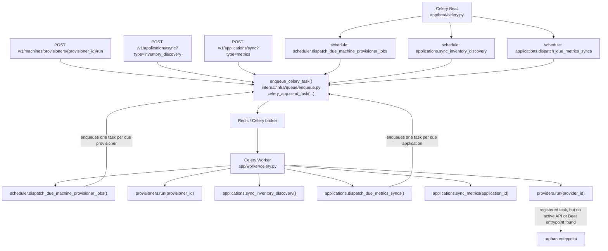

# Celery Task Map

This document maps the Celery runtime entrypoints, the registered tasks, and the code paths that enqueue them.

## Runtime entrypoints

| Runtime | Command | Python entrypoint | Role |
| --- | --- | --- | --- |
| Worker | `uv run celery -A app.worker.celery.celery_app worker --loglevel=INFO --pool=solo` | `app/worker/celery.py` | Imports `app.worker.tasks` so every task is registered in the worker process. |
| Beat | `uv run celery -A app.beat.celery.celery_app beat --loglevel=INFO` | `app/beat/celery.py` | Loads the stateless Beat schedule returned by `app/beat/schedule.py`. |
| Flower | `uv run celery -A app.worker.celery.celery_app flower` | Worker app reuse | Operational UI for queues, workers, and task states. |

## End-to-end execution flow

## Task inventory

| Task name | Python function | Direct entrypoint(s) | Downstream behavior |
| --- | --- | --- | --- |
| `scheduler.dispatch_due_machine_provisioner_jobs` | `dispatch_due_machine_provisioner_jobs_task` | Beat schedule only | Looks for due provisioners, then enqueues `provisioners.run` for each match. |
| `provisioners.run` | `run_provisioner_task` | `POST /v1/machines/provisioners/{provisioner_id}/run`, plus the scheduler dispatcher above | Runs one inventory sync for a provisioner. |
| `applications.sync_inventory_discovery` | `sync_application_inventory_discovery_task` | Beat schedule, `POST /v1/applications/sync?type=inventory_discovery` | Rebuilds the `applications` projection from current machine inventory. |
| `applications.dispatch_due_metrics_syncs` | `dispatch_due_application_metrics_syncs_task` | Beat schedule, `POST /v1/applications/sync?type=metrics` | Selects due applications, then enqueues `applications.sync_metrics` in batches. |
| `applications.sync_metrics` | `sync_application_metrics_task` | Application metrics dispatcher only | Runs one application metrics sync. |
| `providers.run` | `run_provider_task` | No caller found in API routes or Beat schedule | Registered in the worker, but currently appears disconnected from an active entrypoint. |

## Code locations

- Worker bootstrap: `app/worker/celery.py`
- Worker task registry: `app/worker/tasks/__init__.py`
- Beat bootstrap: `app/beat/celery.py`
- Beat schedule: `app/beat/schedule.py`
- Task names: `internal/infra/queue/task_names.py`
- Generic enqueue helper: `internal/infra/queue/enqueue.py`
- Manual API triggers:
  - `app/api/routes/machines/provisioners.py`
  - `app/api/routes/applications.py`
- Task tracking and persisted execution history: `internal/infra/queue/task_tracking.py`

## How to see running and past tasks

- API history: `GET /v1/worker/tasks`
- Flower UI: run `uv run celery -A app.worker.celery.celery_app flower`
- DB-backed tracking: `internal/infra/queue/task_tracking.py` records publish, start, retry, success, and failure transitions into `CeleryTaskExecution`

## Notes

- All task dispatches pass through `enqueue_celery_task()`, which attaches tracking headers before calling `celery_app.send_task(...)`.
- `scheduler.dispatch_due_machine_provisioner_jobs` and `applications.dispatch_due_metrics_syncs` are dispatcher tasks, not terminal business tasks.
- `providers.run` may be intended for a future manual or scheduled entrypoint, but no active caller was found in the current codebase.
