# Celery Task Map

This document maps the Celery runtime entrypoints, the registered tasks, and the code paths that enqueue them.

## Runtime entrypoints

| Runtime | Command | Python entrypoint | Role |
| --- | --- | --- | --- |
| Worker | `uv run celery -A app.worker.celery.celery_app worker --loglevel=INFO --pool=solo` | `app/worker/celery.py` | Imports `app.worker.tasks` so every task is registered in the worker process. |
| Beat | `uv run celery -A app.beat.celery.celery_app beat --loglevel=INFO` | `app/beat/celery.py` | Loads the stateless Beat schedule returned by `app/beat/schedule.py`. |
| Flower | `uv run celery -A app.worker.celery.celery_app flower` | Worker app reuse | Operational UI for queues, workers, and task states. |

## End-to-end execution flow

```mermaid
flowchart TD
    APIProv["POST /v1/machines/provisioners/{provisioner_id}/run"] --> Enqueue
    APIAppInv["POST /v1/applications/sync?type=inventory_discovery"] --> Enqueue
    APIAppMet["POST /v1/applications/sync?type=metrics"] --> Enqueue
    APIProviderSync["POST /v1/machines/providers/sync"] --> Enqueue
    APIOptimizations["POST /v1/machines/{machine_id}/optimizations/recalculate"] --> Enqueue

    Beat["Celery Beat\napp/beat/celery.py"] --> SchedProv["schedule: scheduler.dispatch_due_machine_provisioner_jobs"]
    Beat --> SchedInv["schedule: applications.sync_inventory_discovery"]
    Beat --> SchedMet["schedule: applications.dispatch_due_metrics_syncs"]
    Beat --> SchedCleanup["schedule: maintenance.purge_old_task_executions"]
    Beat --> SchedMachineCleanup["schedule: maintenance.purge_stale_machines"]
    Beat --> SchedApplicationCleanup["schedule: maintenance.purge_stale_applications"]

    SchedProv --> Enqueue
    SchedInv --> Enqueue
    SchedMet --> Enqueue
    SchedCleanup --> Enqueue
    SchedMachineCleanup --> Enqueue
    SchedApplicationCleanup --> Enqueue

    Enqueue["enqueue_celery_task()\ninternal/infra/queue/enqueue.py\ncelery_app.send_task(...)"] --> Broker["Redis / Celery broker"]
    Broker --> Worker["Celery Worker\napp/worker/celery.py"]

    Worker --> DispatchProv["scheduler.dispatch_due_machine_provisioner_jobs()"]
    Worker --> RunProv["provisioners.run(provisioner_id)"]
    Worker --> SyncInv["applications.sync_inventory_discovery()"]
    Worker --> DispatchMet["applications.dispatch_due_metrics_syncs()"]
    Worker --> DispatchProviders["providers.dispatch_enabled_syncs()"]
    Worker --> RunProvider["providers.run(provider_id)"]
    Worker --> RunProviderMachine["providers.run_machine(provider_id, machine_id)"]
    Worker --> RunOptimizations["machines.recalculate_optimizations(machine_id)"]
    Worker --> SyncMet["applications.sync_metrics(application_id)"]
    Worker --> CleanupMachines["maintenance.purge_stale_machines()"]
    Worker --> CleanupApplications["maintenance.purge_stale_applications()"]

    DispatchProv -->|"enqueues one task per due provisioner"| Enqueue
    DispatchMet -->|"enqueues one task per due application"| Enqueue
    DispatchProviders -->|"enqueues one task per enabled provider"| Enqueue
    RunProvider -->|"enqueues one task per visible machine"| Enqueue
    SyncMet -->|"enqueues one task per provider/machine pair for the application batch"| Enqueue
```

## Task inventory

| Task name | Python function | Direct entrypoint(s) | Downstream behavior |
| --- | --- | --- | --- |
| `scheduler.dispatch_due_machine_provisioner_jobs` | `dispatch_due_machine_provisioner_jobs_task` | Beat schedule only | Looks for due provisioners, then enqueues `provisioners.run` for each match. |
| `provisioners.run` | `run_provisioner_task` | `POST /v1/machines/provisioners/{provisioner_id}/run`, plus the scheduler dispatcher above | Runs one inventory sync for a provisioner. |
| `applications.sync_inventory_discovery` | `sync_application_inventory_discovery_task` | Beat schedule, `POST /v1/applications/sync?type=inventory_discovery` | Rebuilds the `applications` projection from current machine inventory. |
| `applications.dispatch_due_metrics_syncs` | `dispatch_due_application_metrics_syncs_task` | Beat schedule, `POST /v1/applications/sync?type=metrics` | Selects due applications, then enqueues `applications.sync_metrics` in batches. |
| `applications.sync_metrics` | `sync_application_metrics_task` | Application metrics dispatcher only | Resolves the machines/providers for one application batch, then enqueues `providers.run_machine` once per visible pair. |
| `maintenance.purge_old_task_executions` | `purge_old_task_executions_task` | Beat daily schedule only | Deletes `celery_task_executions` rows older than the configured retention window. |
| `maintenance.purge_stale_applications` | `purge_stale_applications_task` | Beat daily schedule only | Deletes stale `applications` rows based on `updated_at`, without touching other tables. |
| `maintenance.purge_stale_machines` | `purge_stale_machines_task` | Beat daily schedule only | Deletes stale `machines` rows based on `updated_at`, without cleaning the `applications` projection. |
| `machines.recalculate_optimizations` | `recalculate_machine_optimizations_task` | `POST /v1/machines/{machine_id}/optimizations/recalculate` | Recomputes and versions the optimization projection for one machine. |
| `providers.dispatch_enabled_syncs` | `dispatch_enabled_provider_syncs_task` | `POST /v1/machines/providers/sync` | Selects enabled providers, then enqueues `providers.run` once per provider. |
| `providers.run` | `run_provider_task` | Provider dispatcher only | Resolves the provider scope, then enqueues `providers.run_machine` once per visible machine. |
| `providers.run_machine` | `run_provider_machine_task` | Provider dispatcher only | Collects one machine metric sample for one `provider_id` / `machine_id` pair and upserts the daily metric row. |

## Code locations

- Worker bootstrap: `app/worker/celery.py`
- Worker task registry: `app/worker/tasks/__init__.py`
- Beat bootstrap: `app/beat/celery.py`
- Beat schedule: `app/beat/schedule.py`
- Task names: `internal/infra/queue/task_names.py`
- Generic enqueue helper: `internal/infra/queue/enqueue.py`
- Manual API triggers:
  - `app/api/routes/machines/provisioners.py`
  - `app/api/routes/machines/providers.py`
  - `app/api/routes/applications.py`
- Task tracking and persisted execution history: `internal/infra/queue/task_tracking.py`

## How to see running and past tasks

- API history: `GET /v1/worker/tasks`
- Flower UI: run `uv run celery -A app.worker.celery.celery_app flower`
- DB-backed tracking: `internal/infra/queue/task_tracking.py` records publish, start, retry, success, and failure transitions into `CeleryTaskExecution`

## Notes

- All task dispatches pass through `enqueue_celery_task()`, which attaches tracking headers before calling `celery_app.send_task(...)`.
- `scheduler.dispatch_due_machine_provisioner_jobs`, `applications.dispatch_due_metrics_syncs`, `providers.dispatch_enabled_syncs`, and `providers.run` are dispatcher tasks, not terminal business tasks.
- `maintenance.purge_old_task_executions` is a housekeeping task that keeps the task history table bounded over time.
- `maintenance.purge_stale_applications` is a housekeeping task for the `applications` projection only.
- `maintenance.purge_stale_machines` is a housekeeping task for machine inventory only; `applications` cleanup stays separate.
- `machines.recalculate_optimizations` is the manual entrypoint for on-demand optimization refreshes; automatic refreshes still happen inside the inventory and metric workflows.
- `providers.run_machine` is the terminal execution task for distributed machine metric collection.
- `applications.sync_metrics` is the application-batch pivot: batching cadence is tracked on `applications`, while execution fan-out happens on `provider/machine` child tasks.
